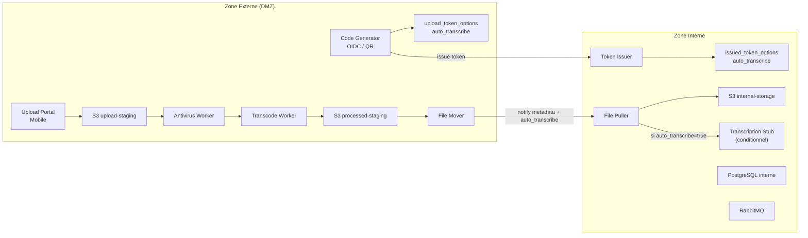
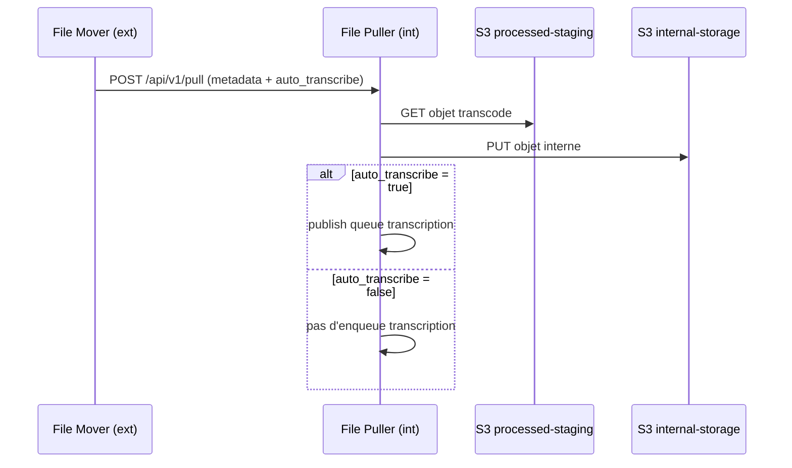
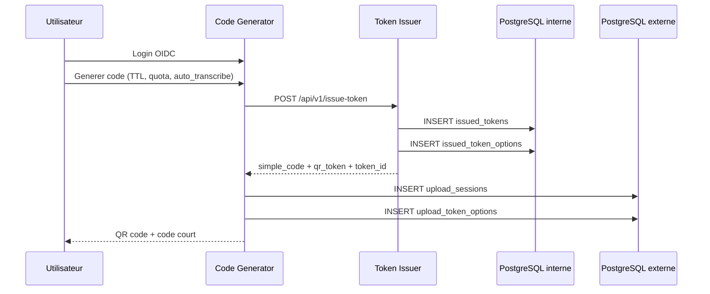
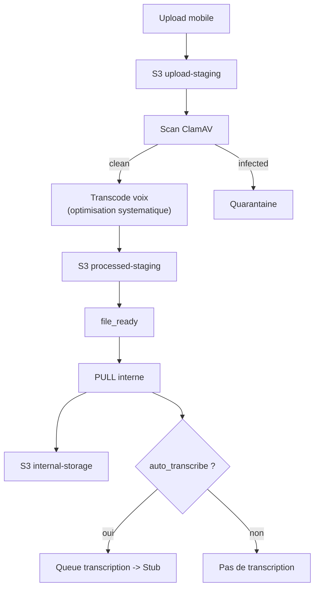
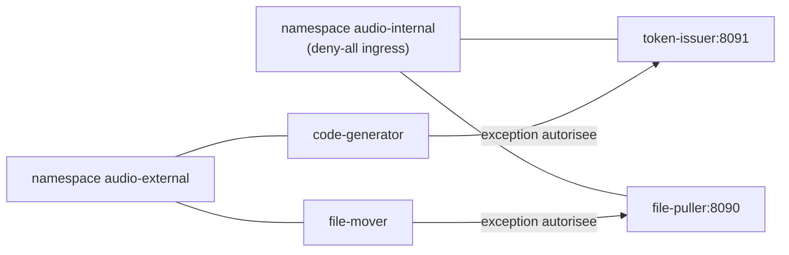

# Architecture & Securite

## Objectif

Le systeme applique un cloisonnement strict entre zone externe et zone interne pour proteger l'identite utilisateur, les tokens de session et les fichiers audio importes.

## Parcours De Lecture

1. `README.md` pour la vue d'ensemble et l'exploitation.
2. `docs/ARCHITECTURE.md` (ce fichier) pour les flux de securite.
3. `tests/DISCOVERY_TEST_PLAN.md` pour la validation utilisateur.
4. `tests/TEST_COVERAGE_STATUS.md` pour le statut de couverture.

## Architecture Logique

## Pattern PULL Inter-Zones

## Flux Generation Token

## Pipeline Audio

## Reseau Et Politiques

## Modeles De Donnees Utiles

- Zone interne:
  - `issued_tokens` (source de verite des tokens)
  - `issued_token_options` (flag `auto_transcribe`)
- Zone externe:
  - `upload_sessions` (suivi d'usage et statut)
  - `upload_token_options` (copie flag `auto_transcribe`)

## Comportement Du Flag auto_transcribe

- Valeur fixee a la creation du token via la checkbox QR.
- Propagee jusqu'a `file-puller` via metadata NOTIFY.
- Effet:
  - `true`: la transcription est mise en file (stub).
  - `false`: pas de mise en file transcription.
- Dans tous les cas, l'audio est optimise pour la voix (antivirus + transcodage).

## Captures Associees

- QR generator: `docs/screenshots/qr-code-gen.png`
- Suivi activite: `docs/screenshots/activity-follow.png`
- Upload mobile: `docs/screenshots/upload-mobile.png`
- Admin: `docs/screenshots/admin-panel.png`
