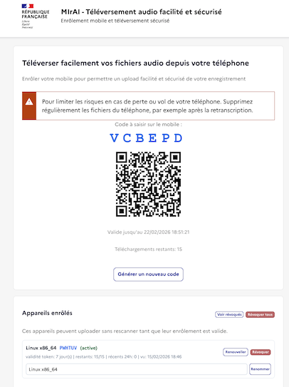
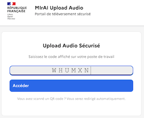
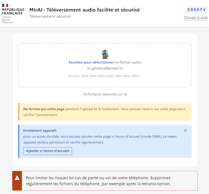

# Test de Découverte du produit - Processus Enrôlement téléphone & Upload

## Références
- `README.md`
- `docs/ARCHITECTURE.md`
- `tests/TEST_COVERAGE_STATUS.md`

## But
Évaluer, avec un utilisateur réel, la compréhension du processus de bout en bout:
- génération du QR,
- enrôlement du device navigateur,
- upload et suivi,
- gestion des devices (renommage/révocation),
- compréhension des messages en cas de blocage.

Ce test vise surtout la **clarté**, la **fluidité** et la **confiance utilisateur**.
Il couvre aussi la compréhension du **renouvellement token (+7 jours + quota)**.

## Format recommandé
- Durée: 30 à 45 minutes
- Animateur: 1 personne
- Testeur: 1 personne (non experte du projet)
- Mode: partage d’écran + prise de notes

## Pré-requis
- Stack disponible (Docker Compose ou Kubernetes)
- Comptes de test OIDC prêts
- 2 navigateurs si possible:
  - Navigateur A: device principal
  - Navigateur B (ou navigation privée): second device
- 1 fichier audio de test

## URLs à préparer
- QR Generator: `https://qrcode-import.fake-domain.name/`
- Upload Portal: URL issue du QR
- Admin Portal: `https://qrcode-import.fake-domain.name/admin/`

## Repères visuels (captures)

1. Génération QR et options token (étape 1)

2. Suivi d'activité (étape 3)

3. Saisie code court mobile (étapes 2-3)

>Cette étape n'est pas nécessaire si le QRCode est flashé, passe directement à l'étape suivante Upload.

4. Upload mobile / statut (étape 3)

5. Vue application mobile (étapes 2-4)

6. Portail admin / compte-rendu (étape 6)

## Scénario guidé (pas à pas)

### 1. Génération et compréhension initiale (5 min)
1. Demander au testeur de générer un QR/code.
2. Vérifier l'affichage de la durée de validité et du quota max de téléchargements.
3. Vérifier la checkbox `Lancer la retranscription automatique et l'ajouter dans MirAI Compte-rendu`.
4. Question: “À quoi sert ce QR selon vous ?”
5. Observer si le rôle du code, sa durée, sa limite d'usage et l'option de retranscription sont compris.

Critères:
- Le testeur comprend qu’il s’agit d’un accès temporaire.
- Le testeur comprend qu’un quota de téléchargements s’applique.
- Le testeur comprend que l'optimisation voix est toujours active, même si la retranscription est désactivée.
- Le testeur comprend où aller ensuite.

### 2. Enrôlement device automatique (8 min)
1. Ouvrir le lien QR dans Navigateur A.
2. Vérifier que la page est utilisable sans action technique.
3. Vérifier la compréhension du message PWA (ajout écran d’accueil).

Critères:
- L’enrôlement n’est pas perçu comme une friction.
- Le message PWA est compris (utile / pas intrusif).

### 3. Upload + suivi (8 min)
1. Uploader un fichier audio avec la checkbox de retranscription activée.
2. Observer la compréhension des statuts (analyse, transcodage, transfert).
3. Générer un second code avec checkbox désactivée et uploader un second fichier.
4. Demander au testeur d’expliquer la différence perçue entre les deux parcours.

Critères:
- Le testeur sait dire “où en est le fichier”.
- Le feedback visuel est jugé suffisant.
- Le testeur comprend l'impact du flag de retranscription automatique.

### 4. Persistance device (5 min)
1. Recharger la page.
2. Vérifier que l’usage continue sans nouvel enrôlement visible.

Critères:
- Le testeur perçoit une continuité naturelle.

### 5. Gestion device côté QR interne (8 min)
1. Aller sur la section “Appareils enrôlés”.
2. Tester le bouton `Voir révoqués` / `Masquer révoqués`.
3. Vérifier les informations visibles (date courte, validité restante).
4. Renommer le device courant.
5. Renouveler le token du device (`+7j`) et vérifier la mise à jour visuelle.
6. Révoquer ce device.
7. Revenir sur l’upload et observer le blocage.

Critères:
- Le testeur comprend ce qu’il vient de renouveler puis révoquer.
- Le message de blocage est clair (renouvellement du token côté admin/QR).
- Le testeur repère visuellement quand le bouton `Renouveller` doit attirer l'attention (token < 2 jours ou uploads restants < 2).

### 6. Vérification admin (5 min)
1. Ouvrir l’admin.
2. Vérifier qu’on retrouve les devices.
3. Vérifier révocation unitaire et révocation globale.
4. Vérifier la cohérence des messages de renouvellement avec l’upload.

Critères:
- Cohérence entre portail utilisateur et admin.

## Questionnaire de feedback (à chaud)

Noter chaque point de 1 (mauvais) à 5 (excellent):
1. Compréhension globale du parcours
2. Simplicité de génération QR
3. Clarté des statuts d’avancement
4. Compréhension de l’enrôlement device
5. Clarté des messages d’erreur/blocage
6. Confiance sécurité perçue
7. Facilité de gestion des devices

Questions ouvertes:
1. À quel moment vous avez hésité ?
2. Quel message vous a semblé ambigu ?
3. Qu’est-ce qui vous rassure le plus ?
4. Qu’est-ce qui manque pour un usage quotidien ?
5. Une amélioration prioritaire à faire ?

## Grille d’observation animateur
- Le testeur comprend-il seul le “prochain clic” ?
- Lit-il les messages ou les ignore-t-il ?
- Comprend-il la différence “session expirée” vs “device révoqué” ?
- Comprend-il quand utiliser “renouveler +7j” au lieu de régénérer un nouveau code ?
- Sait-il retrouver la section devices sans aide ?
- Réagit-il positivement ou négativement au message PWA ?

## Critères de succès (Go / No-Go UX)
- Go:
  - score moyen >= 4/5 sur les 7 items
  - aucun blocage majeur non récupérable
  - message de révocation compris par >= 80% des testeurs
- No-Go:
  - score moyen < 3.5/5
  - incompréhension fréquente de l’état du processus
  - confusion forte sur la révocation/ré-enrôlement

## Modèle de compte-rendu (copier/coller)

Date:
Testeur:
Contexte (device/navigateur):

Résultat par étape:
- Étape 1:
- Étape 2:
- Étape 3:
- Étape 4:
- Étape 5:
- Étape 6:

Scores (1-5):
- Compréhension globale:
- Simplicité QR:
- Clarté statuts:
- Compréhension enrôlement:
- Clarté erreurs:
- Confiance sécurité:
- Gestion devices:

Points forts:
Points de friction:
Priorité d’amélioration #1:
Décision: Go / No-Go
